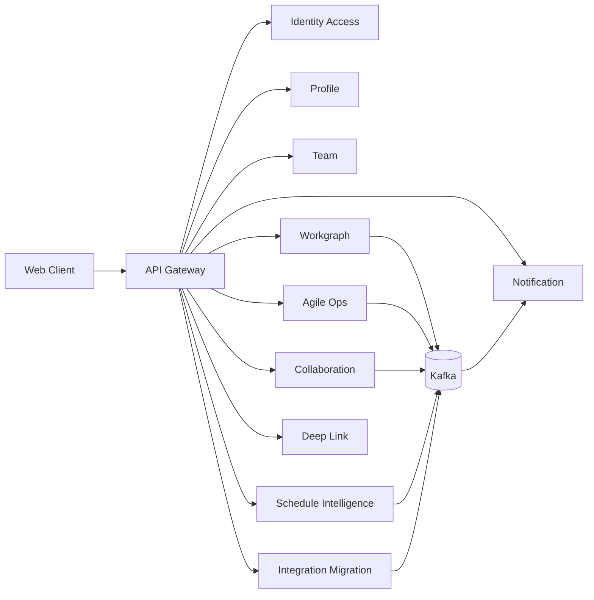

# Implementation Plan: Orbit Schedule Enterprise Collaboration & Scheduling Platform

**Branch**: `001-orbit-schedule-health` | **Date**: 2026-03-03 | **Spec**: `/home/lhs/dev/tasks/specs/001-orbit-schedule-health/spec.md`
**Input**: Feature specification from `/home/lhs/dev/tasks/specs/001-orbit-schedule-health/spec.md`

## Summary

본 계획은 엔터프라이즈 일정 운영 제품(Orbit Schedule)을 구현하기 위한 실행 기준이다. 구현 우선순위는 다음과 같다.

1. 프론트엔드 디자인 플랫폼 선구축
2. 반응형 웹 + 라이트/다크 모드 + 형광 진한 블루 톤 일원화
3. 기존 제공된 디자인 코드(3종)의 구조/분위기 최대 보존
4. 백엔드는 `boilerplate-springboot-grpc` 기반으로 시작하되 기존 Git 이력 제거 후 우리 저장소 기준으로 관리
5. 보일러플레이트 풀스캔 결과와 모의 이벤트스토밍을 기반으로 마이크로서비스 경계 재도출

핵심 원칙은 "UI 감성은 보존하되, 운영 제품으로 확장 가능한 시스템 설계"이다.

## Technical Context

**Language/Version**: Java 21 (backend), TypeScript 5.x (frontend)  
**Primary Dependencies**: Spring Boot 4.x, Spring Security 7, Spring gRPC 1.x, React 18, Vite, Zustand, Tailwind CSS, shadcn/ui  
**Storage**: PostgreSQL 16, Redis  
**Testing**: JUnit 5 + Spring Boot Test + Testcontainers, Vitest + Testing Library, Playwright, OpenAPI/gRPC contract tests  
**Target Platform**: Responsive Web (desktop/tablet/mobile), enterprise browsers  
**Project Type**: Web application (frontend + multi-service backend + integrations)  
**Performance Goals**:
- App shell LCP p75 <= 2.5s (desktop), <= 3.0s (mobile)
- Board interaction response <= 120ms (locally cached state)
- p95 read API <= 300ms, p95 write API <= 500ms
- Notification event-to-inbox <= 5s (95th percentile)
**Constraints**:
- 디자인 방향: 기본 라이트(흰 배경 + 진한 형광 블루), 다크 모드 필수
- 시각 톤: 둥근 카드 중심이 아니라 샤프/각진 구조 우선
- 기존 레퍼런스 UI의 레이아웃/정보 밀도/에디토리얼 무드 보존
- 인증/권한/감사/데이터 통제 기본 내장
- LLM 실패 시 deterministic fallback 필수
**Scale/Scope**:
- 조직 200~5,000명
- 초기 릴리스 20팀/200명, 활성 Work Item 5,000 기준

## Constitution Check

*GATE: Must pass before Phase 0 research. Re-check after Phase 1 design.*

헌법 기준은 백엔드 보일러플레이트에 포함된 파일을 채택한다.
- Reference: `/home/lhs/dev/tasks/backend/boilerplate-springboot-grpc/.specify/memory/constitution.md`

### Gate Evaluation

| Gate | Rule | Status | Notes |
|------|------|--------|-------|
| G1 | 서비스 독립 빌드/실행 | PASS | 서비스별 Gradle 래퍼 및 독립 실행 구조 유지 |
| G2 | 공식 문서 우선 (Spring Security/gRPC) | PASS | 구현 시 공식 레퍼런스 URL을 계약/리서치에 고정 |
| G3 | 계약 우선 및 버전 관리 | PASS | OpenAPI + Proto를 버전드 계약으로 관리 |
| G4 | Hexagonal Architecture 강제 | PASS | domain/application/adapter 경계 테스트 포함 계획 |

### Service Command Gate (Planned)

- API Gateway: `cd backend/orbit-platform/services/api-gateway && ./gradlew build`
- Identity/Access Service: `cd backend/orbit-platform/services/identity-access-service && ./gradlew build`
- Profile Service: `cd backend/orbit-platform/services/profile-service && ./gradlew build`
- Team Service: `cd backend/orbit-platform/services/team-service && ./gradlew build`
- Collaboration Service: `cd backend/orbit-platform/services/collaboration-service && ./gradlew build`
- Notification Service: `cd backend/orbit-platform/services/notification-service && ./gradlew build`
- Workgraph Service: `cd backend/orbit-platform/services/workgraph-service && ./gradlew build`
- Agile Ops Service: `cd backend/orbit-platform/services/agile-ops-service && ./gradlew build`
- Schedule Intelligence Service: `cd backend/orbit-platform/services/schedule-intelligence-service && ./gradlew build`
- Deep Link Service: `cd backend/orbit-platform/services/deep-link-service && ./gradlew build`
- Integration/Migration Service: `cd backend/orbit-platform/services/integration-migration-service && ./gradlew build`

## Project Structure

### Documentation (this feature)

```text
/home/lhs/dev/tasks/specs/001-orbit-schedule-health/
├── spec.md
├── plan.md
├── research.md
├── data-model.md
├── quickstart.md
├── contracts/
│   ├── openapi.yaml
│   └── grpc/
│       └── orbit/schedule/v1/schedule.proto
└── tasks.md
```

### Source Code (repository root)

```text
/home/lhs/dev/tasks/
├── backend/
│   ├── boilerplate-springboot-grpc/          # cloned source snapshot (.git removed)
│   └── orbit-platform/                       # working backend codebase (copied/curated from boilerplate)
│       ├── services/
│       │   ├── api-gateway/
│       │   ├── auth-service/                 # transition-only (to be replaced)
│       │   ├── identity-access-service/      # auth-service evolutionary rename target
│       │   ├── profile-service/
│       │   ├── team-service/
│       │   ├── collaboration-service/
│       │   ├── notification-service/
│       │   ├── workgraph-service/
│       │   ├── agile-ops-service/
│       │   ├── schedule-intelligence-service/
│       │   ├── deep-link-service/
│       │   └── integration-migration-service/
│       └── deploy/
├── frontend/
│   └── orbit-web/
│       ├── src/
│       │   ├── app/
│       │   ├── design/
│       │   │   ├── tokens.css
│       │   │   ├── tailwind.preset.ts
│       │   │   ├── primitives.css
│       │   │   └── layout.css
│       │   ├── components/
│       │   ├── features/
│       │   ├── pages/
│       │   ├── stores/
│       │   └── lib/
│       └── tests/
└── tests/
    ├── contract/
    ├── integration/
    └── e2e/
```

**Structure Decision**: 보일러플레이트 원본은 `backend/boilerplate-springboot-grpc`로 보관하고, 실제 개발 대상은 `backend/orbit-platform`으로 분리한다. 프론트엔드는 레퍼런스 디자인 코드를 기반으로 design-platform-first 전략으로 구축한다.

---

## Backend Bootstrap Plan (Required by request)

### Baseline Status

요청사항에 따라 아래 작업을 완료했다.

1. Clone 완료:
- `git clone https://github.com/julymeltdown/boilerplate-springboot-grpc.git /home/lhs/dev/tasks/backend/boilerplate-springboot-grpc`

2. 기존 Git 기록 제거 완료:
- `/home/lhs/dev/tasks/backend/boilerplate-springboot-grpc/.git` 삭제
- 검증: `[ -d /home/lhs/dev/tasks/backend/boilerplate-springboot-grpc/.git ]` 결과 false

### Reproducible Procedure (to keep in ops docs)

```bash
mkdir -p /home/lhs/dev/tasks/backend
git clone https://github.com/julymeltdown/boilerplate-springboot-grpc.git /home/lhs/dev/tasks/backend/boilerplate-springboot-grpc
find /home/lhs/dev/tasks/backend/boilerplate-springboot-grpc/.git -mindepth 1 -delete
rmdir /home/lhs/dev/tasks/backend/boilerplate-springboot-grpc/.git
```

### Backend Full Scan Scope (Executed)

이번 계획은 실제 코드베이스를 대상으로 풀스캔한 결과를 기반으로 한다.

- 스캔 대상 루트: `/home/lhs/dev/tasks/backend/boilerplate-springboot-grpc`
- 스캔 방식: 서비스 구조/빌드/설정/계약/핵심 도메인 클래스/이벤트 구조/테스트 레이어 확인
- 스캔된 서비스 수: 6 (`api-gateway`, `auth-service`, `profile-service`, `friend-service`, `notification-service`, `post-service`)
- 주요 코드 양(대략): main Java 341개, 테스트 64개
- 계약 산출물: OpenAPI 2종 + gRPC proto 4종
- 핵심 확인: Outbox+Kafka 구조(`post-service`)와 Gateway 정책 구조는 재사용 가치가 높음

### Scan Evidence Inventory (paths audited)

- 서비스 README:
  - `services/api-gateway/README.md`
  - `services/auth-service/README.md`
  - `services/profile-service/README.md`
  - `services/friend-service/README.md`
  - `services/notification-service/README.md`
  - `services/post-service/README.md`
- 서비스 설정:
  - `services/*/src/main/resources/application.yml`
  - `services/*/src/main/resources/application-local.yml`
- 이벤트 문서:
  - `docs/POST_EVENTS_ARCHITECTURE.ko.md`
  - `docs/POST_EVENTS_OPERATIONS.ko.md`
- 계약:
  - `specs/001-jwt-auth-msa/contracts/openapi.yaml`
  - `specs/002-frontend-gateway/contracts/gateway.openapi.yaml`
  - `specs/001-jwt-auth-msa/contracts/grpc/**`

### Scan-discovered Mismatches to Resolve

| Area | Observed | Risk | Plan |
|---|---|---|---|
| Service naming | `auth-service` 명칭이 enterprise IAM 범위를 축소 표현 | 팀/권한/SSO 책임 혼선 | `identity-access-service`로 진화 rename |
| Collaboration model | `friend-service`는 follow 그래프 중심 | 팀 권한 모델 구현 불가 | `team-service`로 대체 |
| Profile persistence | profile은 in-memory adapter 중심 | 운영 데이터 유실/재시작 취약 | JPA adapter 우선 도입 |
| Notification docs vs impl | README 설명은 단순/인메모리 중심, 코드엔 JPA mode 존재 | 운영 모드 혼동 | prod 기본값과 runbook 명확화 |
| Domain event ownership | post-service에 이벤트 인프라가 종속 | 새 도메인 도입 시 재사용 어려움 | outbox/event 공통모듈 추출 |

### Backend Service Strategy (Derived from full scan)

| Existing Service | Current Capability (from scan) | Gap vs Orbit Requirement | Plan Action |
|---|---|---|---|
| `api-gateway` | REST BFF, JWT 검증, refresh cookie, gRPC fan-out, 정책/계약 구성 로더 존재 | Orbit 도메인(팀/스레드/딥링크/일정) 라우트 미존재 | 유지 + `orbit` 라우팅 계약 체계로 확장 |
| `auth-service` | 이메일/OAuth 로그인, JWKS, refresh rotation, Redis 기반 토큰 저장 | 엔터프라이즈 팀/워크스페이스 role claim, SSO 운영 확장 필요 | 유지 + `identity-access-service`로 진화 |
| `profile-service` | gRPC 기반 프로필 CRUD/검색/아바타, 서비스 경계는 양호 | 저장소가 메모리 구현 중심, 조직/팀 멤버십 프로젝션 없음 | 유지 + JPA 영속화 + presence/preference 확장 |
| `friend-service` | 단방향 follow 그래프, 커서 페이징/카운트 모델 | 엔터프라이즈 팀/권한 모델과 불일치(팔로우 중심) | 교체: `team-service` 신설 (RBAC membership 중심) |
| `notification-service` | create/list/read/read-all 흐름 및 gRPC 계약 존재 | 멘션/스레드/우선순위/디제스트/채널 정책 부족 | 유지 + 이벤트 입력 확장 + 룰 기반 fan-out |
| `post-service` | Outbox 저장, internal/external Kafka 이벤트, 재발행 API/스케줄러 | SNS 피드 도메인 중심이라 일정/애자일 도메인과 직접 불일치 | 패턴만 채택: Outbox/Kafka 프레임워크를 공용화 |

### Boilerplate Scan Findings (Service-by-service)

#### 1) `api-gateway` (재사용 우선)

- 근거:
  - JWT/보안 라우팅: `services/api-gateway/src/main/java/com/example/gateway/config/SecurityConfig.java`
  - 정책/계약 도메인: `GatewayGovernanceProperties`, `PolicyService`, `RouteContractService`
  - 알림 read/read-all endpoint 이미 존재: `adapters/in/web/NotificationController.java`
- 판정:
  - BFF + 정책 라우팅 기반이 이미 있으므로 Orbit의 통합 진입점으로 유지
  - Deep link resolver를 gateway에 둘지 분리할지는 이벤트스토밍 결과에 따라 결정

#### 2) `auth-service` (강한 재사용)

- 근거:
  - 로그인/로그아웃/refresh cookie 흐름: gateway `AuthController`
  - 자체 OAuth + 이메일 인증 + 비밀번호 재설정: `services/auth-service/README.md`
  - Redis refresh store port/adapter 분리 구조 존재
- 판정:
  - 로그인/프로필/팀관리 요구의 로그인 축을 즉시 충족 가능
  - 단, enterprise tenant/role/SCIM/SSO 운영은 추가 설계 필요

#### 3) `profile-service` (리팩터링 후 유지)

- 근거:
  - 포트 인터페이스 명확: `ProfileRepositoryPort`
  - 현재 adapter는 메모리 구현 중심: `InMemoryProfileRepository`, `InMemoryAvatarRepository`
- 판정:
  - 프로필, 상태, 알림 선호, 타임존, 로케일을 담는 사용자 컨텍스트 서비스로 확장
  - JPA adapter 신설이 1순위

#### 4) `friend-service` (도메인 교체)

- 근거:
  - follow graph는 사용자 관계 모델에 적합하지만 팀 권한 모델 아님
  - 현재 저장소도 local/test profile의 인메모리 중심
- 판정:
  - `friend-service`는 직접 확장하지 않고 `team-service`로 대체
  - 필요한 cursor/pagination/concurrency 패턴만 이식

#### 5) `notification-service` (확장 재사용)

- 근거:
  - gRPC create/list/mark-read/mark-all API 완비
  - JPA adapter + memory adapter 동시 존재 (`notification.persistence.mode`)
- 판정:
  - 스레드/멘션/일정리스크/시스템공지 모두를 한 inbox 모델로 통합 가능
  - notification type taxonomy와 정책 엔진을 추가

#### 6) `post-service` (패턴 채택, 도메인 비채택)

- 근거:
  - Outbox 저장(`DomainEventOutboxListener`, `PostEventOutboxAdapter`)
  - replay/republish 운영 가이드 문서 완비 (`docs/POST_EVENTS_*`)
- 판정:
  - SNS 게시글 도메인은 제거
  - Outbox/이벤트 파이프라인 모듈은 `platform-event-kit` 형태로 추출하여 Orbit 서비스군에 공통 적용

### Repository Conversion Decision (after scan)

`boilerplate-springboot-grpc`는 "원본 스냅샷"으로 보존하고, 실제 개발은 `backend/orbit-platform`에서 수행한다.

```bash
mkdir -p /home/lhs/dev/tasks/backend/orbit-platform
rsync -a --exclude '.git' /home/lhs/dev/tasks/backend/boilerplate-springboot-grpc/ /home/lhs/dev/tasks/backend/orbit-platform/
```

이후 서비스 변환 규칙:

1. `auth-service`를 복제해 `identity-access-service`로 명칭 확장
2. `friend-service`는 폐기하고 `team-service` 생성
3. `post-service`는 도메인 코드를 제거하고 이벤트 패턴만 공용 모듈로 추출
4. `schedule-service` 단일 신설 대신 bounded context 기준으로 `workgraph`/`agile-ops`/`schedule-intelligence` 분리

### Why this split (revised)

- 스캔 결과 기준으로 "재사용 가능한 것"과 "도메인 불일치로 폐기할 것"이 명확하게 구분됨
- Slack-inspired 협업 요구(스레드/멘션/알림/프로필)와 엔터프라이즈 요구(로그인/팀관리/딥링크/감사)를 동시에 만족하려면 단일 schedule-service로는 경계가 붕괴됨
- 이벤트스토밍 기준 aggregate 경계가 명확한 영역은 독립 서비스로 두는 것이 운영/권한/감사에 유리함

### Slack-inspired Collaboration Scope Lock

이번 단계에서 Slack-inspired 영역은 아래만 포함한다.

- 포함: `thread`, `mention`, `notification inbox`, `profile`, `presence`, `deep link`, `team membership`
- 제외: 채널 음성/화상(huddle), 파일 스토리지 자체, 외부 메신저 완전 대체 기능

즉, 협업 도메인은 "일정 실행 맥락 강화"를 위한 최소 충분 기능으로 설계한다.

---

## Mock Event Storming (Executed for architecture derivation)

실제 워크숍이 아닌 모의 이벤트스토밍을 본 계획에서 수행했고, 결과를 서비스 경계와 계약 초안으로 연결했다.

### Event Storming Scope

- 비즈니스 흐름 시작점: 로그인 후 팀 단위 협업 진입
- 핵심 사용자 액션: Work Item 생성/갱신, 스레드 대화, 멘션, DSU 입력, 일정 평가 요청
- 필수 보조 흐름: 알림 fan-out, 딥링크 진입/복귀, 팀 권한 검증
- 엔터프라이즈 운영 흐름: 감사로그/보존정책/AI 전송통제

### Domain Timeline (High-level)

1. User authenticated
2. Workspace selected
3. Team role checked
4. Work item created or updated
5. Thread opened on work item
6. Mention emitted
7. Notification delivered
8. DSU submitted
9. Deterministic schedule analysis computed
10. AI evaluation requested
11. Advice returned (or fallback)
12. Decision/action item created
13. Deep link shared and resolved
14. Audit trail finalized

### Aggregates and Invariants (from storming)

| Bounded Context | Aggregate | Invariants |
|---|---|---|
| Identity & Access | `Account`, `Session`, `CredentialLink` | 만료/회전되지 않은 refresh token만 유효, 계정 잠금 상태에서 세션 발급 금지 |
| Workspace & Team | `Workspace`, `Team`, `Membership`, `RoleBinding` | 팀 멤버십 없이 프로젝트 접근 금지, 역할 승격은 정책 승인 필요 |
| Profile & Presence | `UserProfile`, `Presence`, `Preference` | username 고유성, 상태메시지 길이/민감어 정책 준수 |
| Workgraph | `WorkItem`, `Dependency`, `Milestone` | dependency cycle 금지, milestone 날짜 무결성, 상태 전이 규칙 준수 |
| Agile Ops | `Sprint`, `BacklogItemRef`, `DSUEntry`, `RetroAction` | 스프린트 기간 중첩 정책 준수, DSU는 팀/작성자/날짜 결합 고유 |
| Collaboration | `Thread`, `ThreadMessage`, `Mention` | thread anchor(work item/doc)가 반드시 존재, 멘션 대상 사용자는 팀 접근권 필요 |
| Notification | `InboxNotification`, `DeliveryRule`, `DigestWindow` | 사용자 mute 규칙 우선, 동일 event-id 중복 삽입 금지 |
| Deep Link | `DeepLinkToken`, `RouteIntent` | 만료 토큰 재사용 금지, 권한 없는 대상 해석 금지 |
| Schedule Intelligence | `EvaluationRequest`, `EvaluationResult`, `RiskRegister` | 스키마 불일치 결과 저장 금지, deterministic 결과는 항상 존재 |
| Integration/Migration | `ImportJob`, `ConnectorSubscription`, `SyncCursor` | 재실행 가능성(idempotency key) 보장, 커서 역행 금지 |

### Commands / Events / Policies Matrix

| Command | Primary Context | Produced Event(s) | Policy / Saga |
|---|---|---|---|
| `LoginByEmail` | Identity | `UserLoggedIn`, `SessionIssued` | 실패횟수 누적 정책, IP/device risk score |
| `RefreshSession` | Identity | `SessionRefreshed`, `RefreshRotated` | 이전 refresh 즉시 폐기 |
| `CreateWorkspace` | Workspace | `WorkspaceCreated` | 엔터프라이즈 플랜 정책 확인 |
| `CreateTeam` | Workspace | `TeamCreated` | owner 최소 1명 invariant |
| `InviteMember` | Workspace | `MemberInvited` | 초대 도메인 제한 정책 |
| `AssignRole` | Workspace | `MemberRoleAssigned` | 고권한 role은 2인 승인 옵션 |
| `UpdateProfile` | Profile | `ProfileUpdated` | username 충돌 검증 |
| `SetPresence` | Profile | `PresenceChanged` | 퇴근시간 자동 오프라인 정책 |
| `CreateWorkItem` | Workgraph | `WorkItemCreated` | 필수 필드 검증 실패 시 reject |
| `LinkDependency` | Workgraph | `DependencyLinked` | cycle detection saga |
| `ShiftMilestone` | Workgraph | `MilestoneShifted` | 영향도 계산 트리거 |
| `StartSprint` | Agile Ops | `SprintStarted` | 동일 팀 중복 active sprint 금지 |
| `SubmitDSU` | Agile Ops | `DSUSubmitted` | 하루 1회 권장, 다중 제출 허용 |
| `OpenThread` | Collaboration | `ThreadOpened` | anchor object 접근권 검증 |
| `PostThreadMessage` | Collaboration | `ThreadMessagePosted` | 민감정보 필터 pre-hook |
| `MentionUser` | Collaboration | `UserMentioned` | mention 대상 권한 확인 |
| `GenerateInbox` | Notification | `NotificationEnqueued` | 채널/빈도 제한 정책 |
| `MarkNotificationRead` | Notification | `NotificationRead` | 읽음 상태 재기록 idempotent |
| `ResolveDeepLink` | Deep Link | `DeepLinkResolved` / `DeepLinkDenied` | auth bounce + RBAC 검증 |
| `RequestScheduleEvaluation` | Schedule Intelligence | `ScheduleEvaluationRequested` | redaction policy 적용 필수 |
| `ComputeDeterministicRisk` | Schedule Intelligence | `DeterministicRiskComputed` | 계산 실패 시 retry queue |
| `RequestLLMAdvice` | Schedule Intelligence | `LLMAdviceRequested` | rate-limit 및 budget guard |
| `CompleteScheduleEvaluation` | Schedule Intelligence | `ScheduleEvaluationCompleted` | schema validation gate |
| `TriggerFallback` | Schedule Intelligence | `EvaluationFallbackTriggered` | deterministic-only response |
| `CreateRetroAction` | Agile Ops | `RetroActionCreated` | 다음 sprint backlog link |
| `StartImportJob` | Integration | `ImportJobStarted` | source scope validation |
| `MapImportedFields` | Integration | `ImportMapped` | 필드 결손 리포트 생성 |
| `FinalizeImportJob` | Integration | `ImportJobCompleted` | rollback snapshot 저장 |

### Hotspots Identified in Event Storming

1. 팀 권한과 멘션/스레드 가시성의 교차 영역
2. 일정 변경 이벤트와 알림 폭주 사이의 균형
3. AI 평가 요청 급증 시 rate-limit/비용 통제
4. 딥링크 접근 실패 시 사용자 경험 단절
5. DSU 자유입력 텍스트의 PII/민감정보 누출 가능성

### Storming Decisions

- Decision A: `friend-service`의 follow 관계를 팀 권한 모델로 재해석하지 않는다.
- Decision B: 협업 객체(`thread`, `mention`)는 work item 도메인과 분리된 bounded context로 독립한다.
- Decision C: LLM 이전에 deterministic risk 계산이 항상 선행되어야 한다.
- Decision D: deep link 해석은 별도 서비스로 분리해 보안/감사를 일원화한다.
- Decision E: notification은 모든 도메인 이벤트의 최종 소비자이자 사용자 노출 채널이므로 독립 유지한다.

### Event Contracts (First-pass naming standard)

- Topic prefix: `orbit.<context>.<event>`
- Internal example:
  - `orbit.workgraph.work-item-created`
  - `orbit.collaboration.user-mentioned`
  - `orbit.agile.dsu-submitted`
  - `orbit.schedule.evaluation-completed`
  - `orbit.notification.notification-enqueued`
- DLT suffix: `.dlt`
- Replay channel: `orbit.replay.<context>`

### Event Envelope (Copy-ready)

```json
{
  "eventId": "uuid",
  "eventType": "orbit.schedule.evaluation-completed",
  "occurredAt": "2026-03-03T12:00:00Z",
  "producer": "schedule-intelligence-service",
  "tenantId": "workspace-id",
  "actorId": "user-id-or-system",
  "aggregateType": "EvaluationRequest",
  "aggregateId": "evaluation-id",
  "schemaVersion": "1.0.0",
  "payload": {},
  "metadata": {
    "correlationId": "trace-id",
    "causationId": "previous-event-id",
    "piiClass": "masked"
  }
}
```

### Outbox Pattern Reuse Rule

`post-service`에서 검증된 다음 패턴을 모든 신규 이벤트 발행 서비스에 강제한다.

1. `BEFORE_COMMIT`에서 Outbox insert
2. `AFTER_COMMIT`에서 internal topic publish
3. publish-record 소비자로 `published=true` 확정
4. scheduler 기반 재발행 + 수동 replay API

이 규칙은 `workgraph-service`, `agile-ops-service`, `collaboration-service`, `schedule-intelligence-service`, `integration-migration-service`에 공통 적용한다.

---

## Derived Target Microservice Topology

모의 이벤트스토밍 결과, `schedule-service` 단일 신설보다 아래 분리가 경계 충돌을 줄인다.

### Final Service List

1. `api-gateway`
2. `identity-access-service` (from auth-service)
3. `profile-service`
4. `team-service` (new)
5. `collaboration-service` (new)
6. `notification-service`
7. `workgraph-service` (new)
8. `agile-ops-service` (new)
9. `schedule-intelligence-service` (new)
10. `deep-link-service` (new)
11. `integration-migration-service` (new)

### Service Boundary Map

| Service | Owns | Reads from | Emits |
|---|---|---|---|
| API Gateway | 외부 REST 계약, 세션 입구, BFF 조합 | all internal gRPC services | gateway telemetry/audit |
| Identity Access | account/session/credential link | profile(minimal), team role claims | session/auth events |
| Profile | profile/presence/preferences | identity user id | profile/presence events |
| Team | workspace/team/membership/role binding | identity user id, profile directory | membership/role events |
| Collaboration | thread/message/mention/subscription | team authorization, profile display | thread/mention events |
| Notification | inbox, read-state, delivery rules | profile preference, team membership | delivery/read events |
| Workgraph | work item/dependency/milestone | team ownership, profile assignee | workgraph/risk seed events |
| Agile Ops | sprint/backlog/dsu/retro action | workgraph refs, team calendar | agile/dsu/blocker events |
| Schedule Intelligence | deterministic risk, LLM orchestration, what-if | workgraph, agile, collaboration signals | evaluation/advice/fallback events |
| Deep Link | link token, route intent, access audit | team authz, gateway auth context | deep-link resolved/denied events |
| Integration/Migration | connector state/import job/sync cursor | all domain services (sync target) | import/sync events |

### Communication Rules

- External clients -> `api-gateway` only
- Service-to-service query -> gRPC
- Cross-context propagation -> Kafka + Outbox
- Critical synchronous authz check -> gRPC request/reply
- Eventually consistent projections -> event consumers

### Mermaid Topology



### Service Creation Priority (pragmatic)

| Priority | Service | Rationale |
|---|---|---|
| P0 | `identity-access-service`, `profile-service`, `team-service` | 로그인/프로필/팀관리 선행 없이는 나머지 기능 검증 불가 |
| P1 | `collaboration-service`, `notification-service`, `deep-link-service` | 스레드/멘션/알림/딥링크 요구 충족 |
| P2 | `workgraph-service`, `agile-ops-service` | 일정 운영의 핵심 모델 |
| P3 | `schedule-intelligence-service` | deterministic+LLM 평가 루프 |
| P4 | `integration-migration-service` | 이관/동기화 확장 |

### Incremental Migration from Boilerplate

1. Step 1: `api-gateway`, `auth-service`, `profile-service`, `notification-service`를 orbit-platform으로 복제
2. Step 2: `auth-service`를 `identity-access-service`로 rename + package rename
3. Step 3: `friend-service` 제거 후 `team-service` 생성
4. Step 4: `post-service`에서 outbox/event 관련 모듈만 추출해 공통 모듈화
5. Step 5: `collaboration-service`, `workgraph-service`, `agile-ops-service`, `schedule-intelligence-service`, `deep-link-service`, `integration-migration-service` 순차 생성
6. Step 6: gateway route-contract를 orbit 도메인 경로로 재정의

### Explicit Keep / Remove / Replace Matrix

| Boilerplate Artifact | Decision | Notes |
|---|---|---|
| `services/api-gateway` | Keep+Extend | governance, route contract 로더 재사용 |
| `services/auth-service` | Keep+Rename | enterprise identity 기능 확장 |
| `services/profile-service` | Keep+Refactor | 인메모리 adapter 제거, JPA 우선 |
| `services/notification-service` | Keep+Extend | type taxonomy/digest/mute 정책 추가 |
| `services/friend-service` | Remove | 팀 기반 권한 모델로 대체 |
| `services/post-service` domain | Remove | SNS 도메인 불일치 |
| `services/post-service` outbox pattern | Extract | 공통 이벤트 모듈로 승격 |

### Boilerplate Change Plan (File-level migration map)

| Action | Source Path | Target Path | Change Type |
|---|---|---|---|
| Gateway 유지 | `services/api-gateway/**` | `services/api-gateway/**` | route contract 확장, orbit endpoint 추가 |
| Auth rename base | `services/auth-service/**` | `services/identity-access-service/**` | package rename + domain 확장 |
| Profile hardening | `services/profile-service/adapters/out/memory/*` | `services/profile-service/adapters/out/persistence/*` | memory -> JPA adapter 교체 |
| Friend 대체 | `services/friend-service/**` | `services/team-service/**` | 신규 도메인으로 재구현 |
| Collaboration 신설 | (none) | `services/collaboration-service/**` | 신규 서비스 |
| Notification 확장 | `services/notification-service/**` | `services/notification-service/**` | mention/thread/risk type 추가 |
| Post outbox 추출 | `services/post-service/application/event/*` + `adapters/out/persistence/PostEventOutbox*` | `services/platform-event-kit/**` (or shared module) | 공통 모듈화 |
| Workgraph 신설 | (none) | `services/workgraph-service/**` | 신규 서비스 |
| Agile Ops 신설 | (none) | `services/agile-ops-service/**` | 신규 서비스 |
| Schedule Intelligence 신설 | (none) | `services/schedule-intelligence-service/**` | 신규 서비스 |
| Deep Link 신설 | (none) | `services/deep-link-service/**` | 신규 서비스 |
| Migration 신설 | (none) | `services/integration-migration-service/**` | 신규 서비스 |

### Boilerplate Refactor Runbook (execution order)

```bash
# 1) Working copy
rsync -a --exclude '.git' backend/boilerplate-springboot-grpc/ backend/orbit-platform/

# 2) Rename auth -> identity-access (initial skeleton)
cp -R backend/orbit-platform/services/auth-service backend/orbit-platform/services/identity-access-service

# 3) Remove friend-service after team-service bootstrapped
mkdir -p backend/orbit-platform/services/team-service

# 4) Extract post outbox pattern into shared module (example)
mkdir -p backend/orbit-platform/services/platform-event-kit

# 5) Create new orbit services
for s in collaboration-service workgraph-service agile-ops-service schedule-intelligence-service deep-link-service integration-migration-service; do
  mkdir -p backend/orbit-platform/services/$s
done
```

### Refactor Guardrails

1. 한 번에 한 서비스씩 경계 이동 (동시 대규모 rename 금지)
2. 서비스별 계약 테스트 통과 후 다음 단계로 이동
3. `friend-service` 삭제는 `team-service` 권한 API 대체 완료 이후에만 수행
4. `post-service` outbox 추출은 회귀 테스트(재발행/중복방지) 완료 이후 merge

### Enterprise SLO by Service Group

- Identity path (`gateway` + `identity-access`): p95 <= 250ms
- Collaboration path (`gateway` + `collaboration` + `notification`): mention-to-inbox p95 <= 5s
- Schedule path (`gateway` + `workgraph` + `agile-ops`): write p95 <= 500ms
- AI path (`schedule-intelligence`): deterministic <= 1s, LLM path timeout budget <= 12s
- Deep link path: valid-case success >= 99%

---

## Frontend Design Platform First Strategy (Mandatory)

요청사항의 핵심은 "기존 제공된 디자인 품질을 훼손하지 않으면서 즉시 재사용 가능한 플랫폼화"다. 따라서 UI 구현 전에 디자인 플랫폼을 먼저 구축한다.

### Design Preservation Rules

- Code 1의 에디토리얼 Hero, 좌측 레일, 대시보드 체계 보존
- Code 2의 Kanban lane 구조, AI 우측 패널 정보 밀도 보존
- Code 3의 스튜디오형 깊이감, 정보 위계, 전략 패널 구조 보존
- 레이아웃 골격/정보 구조/마이크로 인터랙션은 유지
- 색/토큰/코너/명암 체계만 제품 방향에 맞게 통일

### Visual Direction Lock

- 기본 테마: 라이트 (화이트 배경 + 형광 진한 블루)
- 보조 테마: 다크 모드 필수 지원
- 코너: 샤프/각진 느낌 우선 (radius 축소)
- 강조색: Neon Deep Blue
- 금지: 과도한 라운드(pill 중심), 보라/형광녹색/오렌지 중심 팔레트

### Token System (Copy-ready)

#### Global CSS Variables

```css
/* frontend/orbit-web/src/design/tokens.css */
:root {
  --bg: #f7faff;
  --bg-elevated: #ffffff;
  --bg-muted: #edf3ff;
  --text: #0b1220;
  --text-muted: #4b5b76;

  --accent: #155dff;           /* neon deep blue primary */
  --accent-strong: #0048ff;    /* high-emphasis action */
  --accent-soft: #d6e5ff;
  --danger: #ff3b5c;
  --warning: #ff9f1a;
  --success: #14c47a;

  --border: #d9e3f4;
  --border-strong: #9bb4df;
  --ring: #1f63ff;

  --shadow-1: 0 8px 20px rgba(12, 35, 78, 0.08);
  --shadow-2: 0 18px 40px rgba(12, 35, 78, 0.14);

  --radius-xs: 2px;
  --radius-sm: 4px;
  --radius-md: 6px;
  --radius-lg: 8px;
}

[data-theme="dark"] {
  --bg: #070d1a;
  --bg-elevated: #0e1629;
  --bg-muted: #131f38;
  --text: #e9f0ff;
  --text-muted: #9cb3d8;

  --accent: #2a7bff;
  --accent-strong: #4b93ff;
  --accent-soft: #12315d;
  --danger: #ff5a76;
  --warning: #ffb020;
  --success: #1dd38a;

  --border: #233556;
  --border-strong: #3c598a;
  --ring: #5a9bff;

  --shadow-1: 0 10px 30px rgba(0, 0, 0, 0.45);
  --shadow-2: 0 24px 60px rgba(0, 0, 0, 0.55);
}
```

#### Tailwind Preset

```ts
// frontend/orbit-web/src/design/tailwind.preset.ts
import type { Config } from "tailwindcss";

export default {
  darkMode: ["class", '[data-theme="dark"]'],
  theme: {
    extend: {
      colors: {
        orbit: {
          bg: "var(--bg)",
          elevated: "var(--bg-elevated)",
          muted: "var(--bg-muted)",
          text: "var(--text)",
          textMuted: "var(--text-muted)",
          accent: "var(--accent)",
          accentStrong: "var(--accent-strong)",
          accentSoft: "var(--accent-soft)",
          border: "var(--border)",
          borderStrong: "var(--border-strong)",
        },
      },
      borderRadius: {
        xs: "var(--radius-xs)",
        sm: "var(--radius-sm)",
        md: "var(--radius-md)",
        lg: "var(--radius-lg)",
      },
      boxShadow: {
        panel: "var(--shadow-1)",
        floating: "var(--shadow-2)",
      },
      fontFamily: {
        sans: ["Inter", "sans-serif"],
        editorial: ["Syne", "Inter", "sans-serif"],
      },
    },
  },
} satisfies Config;
```

### Primitives (Copy-ready)

```css
/* frontend/orbit-web/src/design/primitives.css */
.orbit-panel {
  background: var(--bg-elevated);
  border: 1px solid var(--border);
  box-shadow: var(--shadow-1);
  border-radius: var(--radius-md);
}

.orbit-panel-glass {
  background: color-mix(in srgb, var(--bg-elevated) 78%, transparent);
  border: 1px solid var(--border);
  backdrop-filter: blur(10px);
  box-shadow: var(--shadow-1);
  border-radius: var(--radius-md);
}

.orbit-card {
  background: var(--bg-elevated);
  border: 1px solid var(--border);
  border-left: 3px solid var(--border-strong);
  border-radius: var(--radius-sm);
  transition: transform .16s ease, border-color .16s ease, box-shadow .16s ease;
}

.orbit-card:hover {
  transform: translateY(-2px);
  border-color: var(--accent);
  box-shadow: var(--shadow-2);
}

.orbit-cta {
  background: var(--accent);
  color: white;
  border: 1px solid var(--accent-strong);
  border-radius: var(--radius-sm);
  box-shadow: 0 0 0 0 rgba(21, 93, 255, 0.35);
  transition: box-shadow .18s ease, transform .18s ease;
}

.orbit-cta:hover {
  box-shadow: 0 0 0 6px rgba(21, 93, 255, 0.12);
  transform: translateY(-1px);
}
```

### Responsive Layout Rules (Mandatory)

- `>=1440`: 3-pane layout (left rail + center board + right intelligence)
- `1024~1439`: right panel collapsible drawer
- `768~1023`: two-pane (top nav + center content), side nav icon mode
- `<768`: single column, board lanes horizontal snap, AI panel bottom sheet

#### Shell Grid Definition

```css
/* frontend/orbit-web/src/design/layout.css */
.app-shell {
  display: grid;
  grid-template-columns: 72px minmax(0, 1fr) 360px;
  min-height: 100vh;
}

@media (max-width: 1439px) {
  .app-shell {
    grid-template-columns: 64px minmax(0, 1fr);
  }
}

@media (max-width: 767px) {
  .app-shell {
    display: block;
  }
}
```

---

## Reference UI Mapping (Do not degrade quality)

### Mapping from Provided Code 1

- Preserve: editorial hero typography, left utility rail, health status emphasis
- Change: orange highlights -> neon blue, full rounded pills -> sharp chips
- Keep: metric storytelling blocks and tactile hierarchy

### Mapping from Provided Code 2

- Preserve: premium kanban lane composition, glass panel rhythm, AI side intelligence block
- Change: neon green accents -> neon blue accents
- Keep: lane title scale, card density, sidebar intelligence monitor

### Mapping from Provided Code 3

- Preserve: strategic dashboard shell, immersive sidebars, stacked insight widgets
- Change: green glow -> blue glow, round-heavy corners -> reduced radius
- Keep: dramatic header hierarchy and high-contrast data storytelling

### Component Equivalence Matrix

| Source Pattern | Orbit Component | Notes |
|---|---|---|
| Hero editorial headline | `HeroMissionPanel` | Code 1의 시선 집중 구조 유지 |
| Kanban lane + cards | `KanbanLane`, `TaskCard` | Code 2 card density와 drag affordance 유지 |
| Intelligence panel | `AiInsightPanel` | Code 2/3 우측 인텔리전스 패널 통합 |
| Strategic left navigation | `WorkspaceRail` | Code 3 스타일 유지, 라이트/다크 동시 지원 |
| Health ring / velocity modules | `HealthGauge`, `VelocityWidget` | 동일 정보구조, 토큰 기반 재색상 |

---

## Frontend Application Plan

### Core Routes

- `/login`
- `/w/:workspaceId/home`
- `/w/:workspaceId/inbox`
- `/w/:workspaceId/team`
- `/w/:workspaceId/projects/:projectId/board`
- `/w/:workspaceId/projects/:projectId/timeline`
- `/w/:workspaceId/projects/:projectId/calendar`
- `/w/:workspaceId/projects/:projectId/table`
- `/w/:workspaceId/projects/:projectId/sprint/:sprintId`
- `/w/:workspaceId/projects/:projectId/thread/:threadId`
- `/dl/:encoded` (deep link resolver)
- `/admin/*`

### Frontend Domain Modules

- `features/auth`: login/session recovery
- `features/profile`: profile + status + preferences
- `features/team`: team lifecycle + role matrix
- `features/work-items`: board/timeline/calendar/table
- `features/agile`: sprint/backlog/dsu/retro
- `features/collaboration`: thread/mention/inbox
- `features/deeplink`: resolve + auth bounce-back
- `features/insights`: health/risk/action dashboards
- `features/admin`: audit/retention/ai-controls

### Slack-inspired UI Scope (explicit)

- 구현 포함:
  - thread panel
  - mention picker/autocomplete
  - inbox notification center
  - profile popover and presence badge
  - team member directory panel
- 구현 제외:
  - standalone chat channel product
  - huddle/voice/video
  - full file drive

### State Management

- Server state: React Query
- Client state: Zustand
- Theme state: `data-theme` (`light`/`dark`/`system`)
- Notification inbox state: optimistic update + websocket/eventstream hydration

### Accessibility and UX Baselines

- keyboard navigation for board cards and thread actions
- focus ring fixed to neon blue (`--ring`)
- minimum text contrast WCAG AA
- reduced motion mode support

---

## Backend Implementation Plan

### Service Responsibilities

#### API Gateway

- authentication/authorization front door
- route contract and policy-set enforcement
- gateway-level rate-limit, resilience, telemetry
- aggregate endpoints for dashboard/inbox/team directory composites

#### Identity Access Service (from auth-service)

- email/OAuth login, refresh rotation, logout
- tenant/workspace-aware claim issuance
- SSO/SAML entry and callback bridge (phase extension)
- session invalidation and security audit emission
- machine-to-machine service token issuance

#### Profile Service

- profile CRUD (display name, title, timezone, locale)
- presence + status message
- notification preference and quiet hours
- avatar/documented profile metadata
- directory projection source for mention picker

#### Team Service (new, friend-service replacement)

- workspace/team/membership/role lifecycle
- invitation + join + removal + role reassignment
- role template (`owner`, `admin`, `member`, `viewer`, `guest`)
- permission query API for gateway and collaboration
- org/team audit trail

#### Collaboration Service (new)

- thread create/update/resolve/reopen
- thread message posting and edit history
- mention extraction + explicit mention API
- subscription/watch model per thread
- thread anchor linkage (`workItemId`, `docId`, `meetingId`)

#### Notification Service

- inbox write/list/read/read-all
- mention/thread/schedule-risk/system event fan-out
- digest + mute + priority policies
- dedup by `(userId, eventId, type)`
- delivery audit and retry hooks

#### Workgraph Service (new)

- work item CRUD (Task/Story/Bug/Epic/Improvement)
- dependency graph and cycle guard
- milestone binding + date integrity checks
- critical-path input model provisioning
- project-level timeline projection

#### Agile Ops Service (new)

- sprint lifecycle (plan/start/close)
- backlog ordering and readiness checks
- DSU intake and linkage to work items
- retrospective action tracking
- team capacity ledger (vacation/meeting reflected)

#### Schedule Intelligence Service (new)

- deterministic schedule analysis (critical path/slack/overload)
- DSU signal normalization orchestration
- LLM request orchestration + schema validation
- confidence gating + fallback generation
- risk register generation and ranking

#### Deep Link Service (new)

- canonical route intent creation
- short token mint/resolve
- auth bounce state preserve/restore
- authorization checks before final resolution
- deep-link access audit log

#### Integration Migration Service (new)

- Trello/monday/Notion import job orchestration
- connector subscription/webhook cursor management
- calendar/slack/github sync state machine
- mapping validation + rollback snapshot
- data reconciliation reports

### Integration Contracts (planned)

- REST public API: `contracts/openapi.yaml`
- gRPC internal contracts:
  - `identity.v1` authz/session/member claim lookups
  - `profile.v1` profile/presence/preferences lookups
  - `team.v1` membership and permission checks
  - `collaboration.v1` thread/mention operations
  - `notification.v1` inbox and delivery control
  - `workgraph.v1` work item/dependency/milestone operations
  - `agile.v1` sprint/backlog/dsu operations
  - `schedule.v1` deterministic+AI evaluation
  - `deeplink.v1` token creation/resolution
  - `migration.v1` import/sync job lifecycle

### Contract Evolution Rules

1. 모든 gRPC는 `v1` 패키지로 시작하고, 브레이킹 변경은 `v2` 병행 출시
2. gateway REST는 내부 gRPC 계약과 1:N 매핑 가능하되 공개 계약(OpenAPI)이 canonical
3. 이벤트 계약(Kafka)은 schema version 필드를 필수화
4. idempotent command는 `idempotencyKey`를 필수 지원
5. deep link resolution 결과는 성공/거절 모두 감사 이벤트 기록

### REST Endpoint Blueprint (copy-ready first draft)

| Domain | Method | Path | Owner |
|---|---|---|---|
| Auth | `POST` | `/auth/login` | Gateway -> Identity |
| Auth | `POST` | `/auth/refresh` | Gateway -> Identity |
| Auth | `POST` | `/auth/logout` | Gateway -> Identity |
| Profile | `GET` | `/api/profile/{userId}` | Gateway -> Profile |
| Profile | `PUT` | `/api/profile/{userId}` | Gateway -> Profile |
| Team | `POST` | `/api/teams` | Gateway -> Team |
| Team | `POST` | `/api/teams/{teamId}/members` | Gateway -> Team |
| Team | `PATCH` | `/api/teams/{teamId}/members/{memberId}/role` | Gateway -> Team |
| Collaboration | `POST` | `/api/threads` | Gateway -> Collaboration |
| Collaboration | `POST` | `/api/threads/{threadId}/messages` | Gateway -> Collaboration |
| Collaboration | `POST` | `/api/threads/{threadId}/mentions` | Gateway -> Collaboration |
| Notification | `GET` | `/api/notifications` | Gateway -> Notification |
| Notification | `PATCH` | `/api/notifications/{id}/read` | Gateway -> Notification |
| Workgraph | `POST` | `/api/work-items` | Gateway -> Workgraph |
| Workgraph | `POST` | `/api/work-items/{id}/dependencies` | Gateway -> Workgraph |
| Agile | `POST` | `/api/sprints` | Gateway -> Agile Ops |
| Agile | `POST` | `/api/sprints/{id}/dsu` | Gateway -> Agile Ops |
| Intelligence | `POST` | `/api/schedule/evaluations` | Gateway -> Schedule Intelligence |
| Deep Link | `GET` | `/dl/{token}` | Gateway -> Deep Link |
| Migration | `POST` | `/api/import/jobs` | Gateway -> Integration Migration |

### gRPC Package Blueprint (copy-ready naming)

```text
orbit.identity.v1
orbit.profile.v1
orbit.team.v1
orbit.collaboration.v1
orbit.notification.v1
orbit.workgraph.v1
orbit.agile.v1
orbit.schedule.v1
orbit.deeplink.v1
orbit.migration.v1
```

### Data Architecture

- PostgreSQL (service-per-schema): transactional source of truth
  - `identity`, `profile`, `team`, `collaboration`, `notification`, `workgraph`, `agile`, `deeplink`, `migration`
- Redis:
  - session/token cache
  - mention/deeplink hot route cache
  - rate-limit buckets
  - LLM evaluation dedup cache
- Kafka:
  - cross-context event propagation
  - replay/DLT operational channels
- Outbox tables (per event-producing service):
  - guaranteed event persistence before publish
  - replayability and operational recovery
- Audit store:
  - immutable append-only audit events
  - export path to SIEM (JSONL or streaming)

### Persistence Hardening Tasks (from scan gaps)

1. `profile-service`: in-memory repository를 JPA adapter로 교체
2. `team-service`: 신규 JPA 모델 + unique constraints 구성
3. `collaboration-service`: thread/message/mention write model + read projection 분리
4. `notification-service`: JPA mode를 production default로 고정, memory mode는 test-only 제한
5. `workgraph-service`: dependency edge 테이블에 cycle-precheck 인덱스 전략 수립
6. `agile-ops-service`: DSU raw + normalized payload 동시 저장
7. `schedule-intelligence-service`: evaluation result snapshot 저장 + schema hash 기록

### Security and Governance Hooks by Service

| Service | Required Controls |
|---|---|
| Gateway | JWT validation, route policy, request tracing, CORS allowlist |
| Identity Access | refresh rotation, breach lock policy, key rotation hooks |
| Profile | PII masking rules on export |
| Team | role change audit, least-privilege guard |
| Collaboration | mention authorization checks, message retention policy |
| Notification | user preference enforcement, noisy-event suppression |
| Workgraph | field-level history and immutable change log |
| Agile Ops | DSU content filtering and retention classes |
| Schedule Intelligence | `store:false` option propagation, prompt redaction logs |
| Deep Link | token TTL, one-time use, denied access audit |
| Integration Migration | connector secret isolation, scoped OAuth tokens |

---

## AI and Scheduling Diagnosis Plan

### Deterministic Layer

- critical path computation (dependency DAG 기반)
- slack time and overdue propagation
- team capacity overload detection
- sprint commitment vs remaining capacity drift
- blocker impact radius 계산 (`blocked` item이 영향 주는 downstream set)
- milestone breach probability 산출 (rule-based)

### Deterministic Engine Inputs

1. `workgraph-service`: item/dependency/milestone snapshot
2. `agile-ops-service`: sprint/backlog/dsu links
3. `team-service`: assignee capacity and role scope
4. `collaboration-service`: unresolved thread and mention pressure signals

### Deterministic Engine Outputs

- `riskScore` (0-100)
- `health` (`on_track`, `at_risk`, `off_track`)
- `topRisks[]` (type, impact, evidence)
- `actionCandidates[]` (who/when/what)

### LLM Layer

- DSU signal extraction (blocker, ask, urgency)
- thread/message context summarization
- narrative explanation for risks
- action recommendations (who/when/what)
- question generation when confidence low
- 일정 변경 What-if 해석(범위 축소/리소스 증원/마일스톤 이동)

### LLM Request Policy

- pre-redaction: PII and secrets masking
- tenant policy check: AI allowed scope verification
- prompt budget control: context window hard cap
- structured output contract: JSON schema strict mode
- audit trail: prompt hash + model + latency + outcome

### Reliability Rules

- schema validation mandatory
- timeout/429/schema error -> deterministic fallback
- low confidence -> ask-first response
- policy redaction before LLM request
- duplicate evaluation dedup key (`scopeHash + window + revision`)
- retry with jitter and max-attempt limit
- graceful degradation message must include retry hint and deterministic evidence

### Schedule Intelligence APIs (implementation-first draft)

- `POST /v1/evaluations`
  - purpose: full schedule health evaluation
  - path: gateway -> schedule-intelligence -> workgraph/agile/team/collab -> optional LLM
- `POST /v1/evaluations/dsu-extract`
  - purpose: DSU normalization and blocker extraction
- `POST /v1/evaluations/what-if`
  - purpose: compare baseline and scenario plans
- `GET /v1/evaluations/{evaluationId}`
  - purpose: retrieve immutable evaluation snapshot

### Success Criteria for AI Layer

| Metric | Target |
|---|---|
| Schema valid response ratio | >= 99% |
| Deterministic fallback availability | 100% |
| p95 deterministic latency | <= 1s |
| p95 total evaluation latency (with LLM) | <= 12s |
| Helpful feedback ratio | >= 70% (pilot phase) |

---

## Deep Link Plan (Product-wide)

### Canonical Patterns

- `/w/{workspaceId}/p/{projectId}/item/{itemId}`
- `/w/{workspaceId}/p/{projectId}/thread/{threadId}`
- `/w/{workspaceId}/inbox/{notificationId}`
- `/w/{workspaceId}/team/{teamId}/member/{memberId}`
- `/w/{workspaceId}/sprint/{sprintId}/dsu/{entryId}`
- `/dl/{token}` short-link resolver

### Resolution Flow

1. validate token / route
2. check authentication
3. check authorization
4. restore context (workspace/project/thread)
5. land user on exact target
6. write deep-link access audit event

### Auth Bounce Flow

1. 익명 사용자가 `/dl/{token}` 접근
2. `deep-link-service`가 target intent를 읽고 nonce 생성
3. gateway가 `/login?next=<signed-nonce>`로 리다이렉트
4. 로그인 완료 후 nonce 검증
5. 원래 target route로 복귀

### Deep Link Security Rules

- token TTL 기본 24시간 (관리자 정책으로 축소 가능)
- 고위험 링크(관리자 화면, 민감 문서)는 1회성 토큰 강제
- 권한 실패 시 대상 경로를 노출하지 않고 generic denied 화면 반환
- 모든 resolve 시도는 성공/실패 포함 감사로그 기록

### Deep Link Contract (copy-ready response shape)

```json
{
  "status": "resolved",
  "targetRoute": "/w/ws-1/p/p-9/thread/th-222",
  "requiresAuthBounce": false,
  "requiresAdditionalPermission": false,
  "auditId": "AUD-20260303-1001"
}
```

---

## Delivery Milestones

### M-1 - Boilerplate Cutover (1 week)

- clone snapshot 확인 및 `.git` 제거 검증
- `backend/orbit-platform` 작업 트리 생성
- CI seed 파이프라인 (서비스별 독립 build) 구성
- 공통 코드 규칙/패키지 규칙/브랜치 전략 확정

**Exit Criteria**:
- `backend/boilerplate-springboot-grpc`는 read-only snapshot으로 잠금
- `backend/orbit-platform`에서 신규 커밋 시작
- 서비스별 build command gate 통과

### M0 - Design Platform Foundation (2 weeks)

- token system, dark mode, sharp component primitives
- shell/grid responsive baseline
- reference screens rebuilt with neon deep blue palette
- code1/2/3 구조 매핑 문서와 컴포넌트 카탈로그 작성

**Exit Criteria**:
- 3 provided reference UIs mapped to reusable components
- light/dark parity validated
- mobile/tablet/desktop snapshots complete
- 라운드 과다 컴포넌트 제거(샤프 톤 준수)

### M1 - Identity + Profile + Team Foundation (2~3 weeks)

- `identity-access-service` 생성 (auth-service 기반)
- 로그인/session refresh/logout + role claim 확장
- `profile-service` JPA hardening + presence/preferences
- `team-service` 신규 생성 (friend-service 대체)

**Exit Criteria**:
- role-based access checks pass
- profile state visible in collaboration surfaces
- 팀 생성/초대/역할 변경/제거의 감사로그 확인

### M2 - Collaboration Core (2~3 weeks)

- `collaboration-service` 신규 생성
- thread/message/mention/subscription 모델 구현
- `notification-service` 연동으로 mention-to-inbox fan-out
- gateway API 확장 (`/threads`, `/mentions`, `/inbox`)

**Exit Criteria**:
- 스레드 생성/멘션/읽음처리 E2E 통과
- mention-to-inbox <= 5s p95
- 멘션 권한 검증(팀 외부 사용자 차단) 통과

### M3 - Deep Link + Access Recovery (1~2 weeks)

- `deep-link-service` 신규 생성
- `/dl/{token}` 해석, auth bounce, 원위치 복귀 구현
- 접근 실패 시 보안형 denied fallback

**Exit Criteria**:
- deep link success >= 99% (auth/permission valid cases)
- 로그인 바운스 후 컨텍스트 복귀 정확도 >= 99%
- resolve 성공/실패 감사로그 100% 기록

### M4 - Workgraph + Agile Ops (3 weeks)

- `workgraph-service`와 `agile-ops-service` 신규 생성
- work item/dependency/milestone/sprint/backlog/dsu/retro 도메인 구현
- board/timeline/calendar/table view와 API 연결

**Exit Criteria**:
- dependency cycle guard works
- dsu-to-work-item linking and summary visible
- sprint capacity vs commitment drift 계산 가능

### M5 - Schedule Intelligence (3 weeks)

- `schedule-intelligence-service` 신규 생성
- deterministic analysis + LLM orchestration + fallback
- 구조화 출력(JSON schema) 검증 및 저장
- risk register/action suggestion 파이프라인 연결

**Exit Criteria**:
- schema-validated output
- fallback always returns actionable response
- low confidence path returns ask-first response

### M6 - Integrations + Migration + Governance Hardening (3~5 weeks)

- `integration-migration-service` 신규 생성
- Trello/monday/Notion import job + validation report + rollback snapshot
- Slack/Calendar/GitHub connector phase-1 동기화
- retention/audit/AI controls 강화

**Exit Criteria**:
- pre-apply validation report generated on every run
- migration rollback point recorded
- sensitive events fully auditable
- connector token rotation and webhook retry runbook 완성

---

## Test & Validation Strategy

### Frontend

- unit: tokens/theme utilities, deeplink resolver, route guards
- component: task card, lane, thread panel, inbox drawer, profile popover
- e2e:
  - login -> workspace -> board
  - mention -> inbox -> deep link jump
  - theme toggle (light/dark) + responsive checks

### Backend

- contract tests:
  - gateway/openapi
  - identity/profile/team/collaboration/notification/workgraph/agile/schedule/deeplink/migration gRPC
- integration tests:
  - session lifecycle
  - team role enforcement
  - thread mention authorization
  - notification dedup and read transitions
  - deep link auth bounce and return context
  - dsu extraction pipeline
  - schedule evaluation fallback path
- architecture tests:
  - hexagonal boundary rules
  - cross-context forbidden dependency tests
  - outbox/replay idempotency tests

### Acceptance Test Matrix (critical)

1. 로그인 후 권한 워크스페이스만 접근
2. 프로필 상태 변경이 멘션/알림에 반영
3. 팀 역할 변경 즉시 권한 반영
4. 스레드 생성/멘션/알림 도달
5. 딥링크 로그인 바운스 후 원대상 복귀
6. AI 실패 시 deterministic fallback 반환
7. dependency cycle 생성 시 서버 거절
8. import preview에서 누락 필드 리포트 생성
9. notification read-all은 idempotent 동작 유지

---

## Risks and Mitigations

- **디자인 변형 리스크**: 참조 UI 컴포넌트 매핑 문서 + 시각 회귀 테스트
- **모드 불일치 리스크**: token-only styling 원칙, 하드코드 색상 금지 lint 적용
- **알림 소음 리스크**: mute, priority, digest 기본 제공
- **딥링크 보안 리스크**: auth+RBAC 체크 후 렌더링, 접근 감사
- **AI 품질 리스크**: schema validation + confidence gating + fallback
- **보일러플레이트 부채 리스크**: 서비스별 제거/확장 계획을 ADR로 고정
- **마이크로서비스 과분해 리스크**: 도메인별 ownership이 불명확해지면 운영비 증가 -> bounded context ADR + 서비스 합병 기준 사전 정의
- **이벤트 순서 역전 리스크**: outbox는 보장하지만 소비 순서 역전 가능 -> consumer idempotency + causal ordering key 도입
- **프로필/팀 데이터 정합 리스크**: 사용자 이동/퇴사 시 잔여 권한 -> SCIM 이벤트 기반 멤버십 정리 잡 필수
- **스레드 멘션 오탐 리스크**: 텍스트 파서 과탐지 -> explicit mention UI 우선 + 파서 confidence threshold
- **이관 기대치 불일치 리스크**: source별 미지원 필드 -> import preflight에서 지원/미지원 명세 강제 표시

---

## Phase 0/1 Design Artifacts to Generate Next

- `research.md`: 디자인 토큰 결정, 서비스 분리 근거, AI fallback 정책
- `data-model.md`: user/team/profile/thread/mention/notification/workitem/sprint/evaluation entities
- `contracts/openapi.yaml`: auth/profile/team/thread/mention/notification/deeplink/evaluation endpoints
- `contracts/grpc/orbit/identity/v1/identity.proto`: session/claim/member context
- `contracts/grpc/orbit/team/v1/team.proto`: membership/role checks
- `contracts/grpc/orbit/collaboration/v1/collaboration.proto`: thread/mention commands
- `contracts/grpc/orbit/schedule/v1/schedule.proto`: evaluation and risk events
- `event-storming.md`: commands/events/policies/read-model inventory
- `boilerplate-gap-analysis.md`: keep/remove/replace 근거와 이전 순서
- `quickstart.md`: dev bootstrap, theme check, service runbook

## Complexity Tracking

| Violation | Why Needed | Simpler Alternative Rejected Because |
|-----------|------------|-------------------------------------|
| Multi-service backend + gateway | existing boilerplate strengths and enterprise boundaries | monolith would slow ownership and contract clarity |
| Design platform first before feature pages | preserve quality and enforce consistency | page-by-page styling causes drift and expensive rework |
| Dual theme (light/dark) mandatory | enterprise usage contexts vary | light-only fails night operations and accessibility needs |
